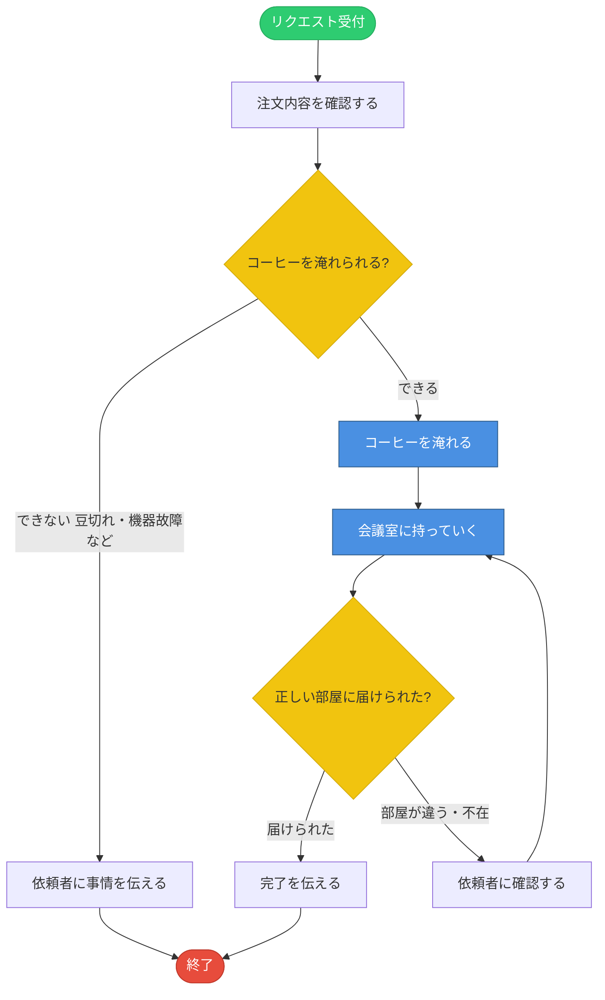

# コーヒー給仕サービス - SOP

**Document Type**: SOP
**Version**: 1.0
**Date**: 2026-04-01
**Author**: matsuo（イグアス）
**Source**: 業務説明「コーヒーを淹れて会議室に持っていく」
**Status**: Draft

---

## Document Control

**Approvers**:
- Business Owner: TBD
- Process Owner: TBD

**Review Cycle**: 随時
**Next Review Date**: TBD

---

## 1. Executive Summary

- **Procedure Name**: コーヒー給仕サービス
- **Business Problem**: 会議中の参加者が席を離れることなくコーヒーを入手できない
- **Business Objective**: 依頼者がリクエストするだけで、希望のコーヒーが指定の会議室に届く
- **Scope**: リクエスト受付〜会議室への配達完了まで。コーヒー豆の調達・機器メンテナンスは対象外
- **Key Benefits**:
  1. 会議の中断を最小化できる
  2. 依頼者が自分で準備する手間がなくなる
- **Stakeholders**: コーヒーを依頼する人、コーヒーを届ける人
- **Success Criteria**: 依頼されたコーヒーが指定の会議室に届いていること

---

## 2. Business Process Flow Diagram

**凡例**:
- 🟢 開始・終了
- 🟡 判断ポイント
- 🔵 主要アクション
- 白 標準ステップ

---

## 3. Business Context

#### 3.1 Problem Statement
コーヒーを飲みたい人が自分で席を立って準備しなければならない。会議中はこれが特に不便。

#### 3.2 Current State
依頼者が自分でコーヒーを淹れている。または誰かに口頭で頼んでいる。

#### 3.3 Desired Future State
リクエストを送るだけで誰かがコーヒーを届けてくれる。

---

## 4. Procedure Overview

#### 4.1 Purpose and Scope
- **Primary Purpose**: コーヒーのリクエストを受け付け、会議室に届ける
- **In Scope**: リクエスト受付、コーヒーを淹れる、配達、完了確認
- **Out of Scope**: コーヒー豆・材料の調達、機器のメンテナンス、複数ドリンクへの対応

#### 4.2 Roles and Responsibilities

**依頼者**:
- コーヒーをリクエストする（種類・部屋・人数）
- 届いたことを受け取る

**給仕担当者**（またはシステム）:
- リクエストを受け付ける
- コーヒーを淹れて届ける
- 完了を伝える

#### 4.3 Frequency and Timing
- **Trigger**: 依頼者がコーヒーのリクエストを送る
- **Frequency**: オンデマンド
- **Business Hours**: 特に定義なし

---

## 5. Data Requirements

#### 5.1 Input Data

**コーヒーリクエスト**:
- **Description**: 依頼者が必要としているコーヒーの情報
- **Source**: 依頼者からの入力
- **Format**: 会議室名、杯数、コーヒーの種類（ブラック・ミルクあり等）
- **Required**: はい
- **Validation Rules**: 会議室名が存在すること、杯数が1以上であること
- **Example**: 「会議室A、2杯、ブラック」

#### 5.2 Data Used During Procedure

**コーヒー在庫状況**:
- **Description**: 豆・ミルク等の材料が揃っているかどうか
- **Purpose**: リクエストに応じられるか判断するため
- **Source**: キッチンの現場確認

#### 5.3 Output Data

**配達完了通知**:
- **Description**: コーヒーを届けたという報告
- **Purpose**: 依頼者が受け取ったことを確認するため
- **Destination**: 依頼者
- **Format**: 口頭または通知メッセージ

---

## 7. Business Procedure Steps

**Step 1: リクエストを受け付ける**
- **What Happens**: 誰かから「コーヒーを持ってきてほしい」というリクエストが届く
- **Who Does It**: 給仕担当者（またはシステム）
- **Inputs**: 会議室名、杯数、種類
- **Outputs**: 受付確認
- **Success Criteria**: 必要情報が揃っている

**Step 2: 材料を確認する**
- **What Happens**: コーヒー豆・ミルク等が揃っているか確認する
- **Who Does It**: 給仕担当者
- **Outputs**: 対応可能 or 対応不可

**Step 3: コーヒーを淹れる**
- **What Happens**: 指定された種類のコーヒーを指定杯数分淹れる
- **Who Does It**: 給仕担当者（**物理的作業。人間またはロボットが必要**）
- **Inputs**: コーヒー豆、水、ミルク（必要に応じて）
- **Outputs**: 完成したコーヒー

**Step 4: 会議室に持っていく**
- **What Happens**: 淹れたコーヒーを指定の会議室まで運ぶ
- **Who Does It**: 給仕担当者（**物理的移動。人間またはロボットが必要**）
- **Outputs**: 届けられたコーヒー

**Step 5: 完了を伝える**
- **What Happens**: 届けたことを依頼者に伝える
- **Who Does It**: 給仕担当者（またはシステム）

---

## 8. Decision Points

**Decision 1: コーヒーを淹れられるか？**
- **Question**: 材料・機器が揃っているか？
- **Outcomes**: 可能 → 淹れる、不可 → 依頼者に連絡

**Decision 2: 正しい会議室に届けられたか？**
- **Question**: 指定の部屋・人物に届いたか？
- **Outcomes**: 届いた → 完了、届かなかった → 再確認

---

## チーム命名規則（必須）

複数人で IG 環境を共有しているため、新規定義するリソースには
必ず私（matsuo）のサフィックスを付与してください：

- エージェント名: `M-` プレフィックス（例: M-japanese-rag-agent）
- ナレッジベース名: `m-` プレフィックス（例: m-kb-slate-en, m-kb-granite-ml）
- ツール名・関数名: `m_` プレフィックス（例: m_fetch_corpus, m_run_evaluation）
- YAML ファイル名も同じルールに従う

---

## 11. Notes and Observations

#### ⚠️ 重要な観察：このプロセスにおけるAIエージェントの限界

このプロセスの核心部分（Step 3「コーヒーを淹れる」・Step 4「会議室に持っていく」）は**物理的な作業**です。

| ステップ | AIエージェントで実行可能？ | 理由 |
|---|---|---|
| リクエスト受付 | ✅ 可能 | テキスト処理 |
| 材料確認 | ⚠️ 限定的 | IoTセンサー等が必要 |
| **コーヒーを淹れる** | ❌ 不可 | **物理的作業** |
| **会議室に持っていく** | ❌ 不可 | **物理的移動** |
| 完了通知 | ✅ 可能 | テキスト処理 |

**AIエージェントが実現できること**:
- リクエストの受付と確認（「ブラック2杯、会議室Aですね」）
- 人間の給仕担当者への**タスク転送・通知**
- 完了後の記録

**結論**: このプロセスに対してWxOエージェントを作るとすれば、「コーヒーを届ける」エージェントではなく、**「コーヒーのリクエストを受け付けて担当者に通知するエージェント」** になります。
