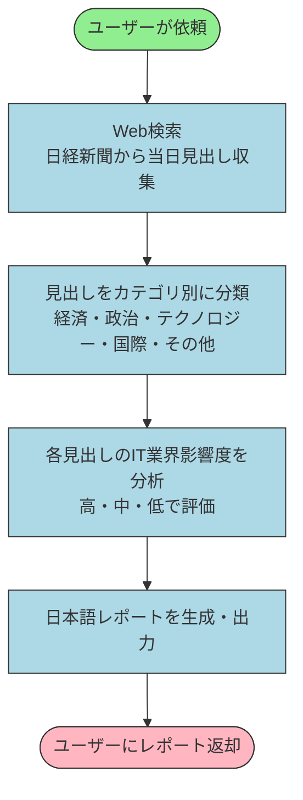

# 日経新聞 朝刊ITインパクトレポート生成 - SOP

**Document Type**: SOP
**Version**: 1.0
**Date**: 2026年3月31日
**Author**: matsuo（イグアス）
**Source**: 業務フロー説明（テキスト記述）
**Status**: Draft

---

## Document Control

**Approvers**:
- Business Owner: TBD
- Process Owner: TBD

**Review Cycle**: 随時
**Next Review Date**: TBD

---

## 1. Executive Summary

- **Procedure Name**: 日経新聞 朝刊ITインパクトレポート生成
- **Business Problem**: IT系コンサルタント・営業担当者が毎朝、日経新聞の主要ニュースを確認し、IT業界への影響を自分で読み解くのに時間がかかる
- **Business Objective**: 当日朝の日経主要見出しを自動収集・分析し、IT業界への示唆をまとめたレポートを即座に提供する
- **Scope**: 当日午前中の日経新聞ウェブ掲載記事（最大10件）。メール・Slack等への自動配信は対象外
- **Key Benefits**:
  - 毎朝の情報収集・読み解き時間を削減
  - IT影響度の一次スクリーニングを自動化
  - 商談・提案準備のインプットとして即活用できる
- **Stakeholders**: イグアス社内のITコンサルタント・営業担当者
- **Success Criteria**: ユーザーが「今日の日経ニュースをまとめて」と依頼して、見出し・カテゴリ・IT影響度・示唆コメントを含むレポートが返却される

---

## 2. Business Process Flow Diagram



**凡例**:
- 緑: 開始点（ユーザートリガー）
- 青: 主要処理ステップ（エージェント実行）
- ピンク: 終了点（レポート返却）

---

## 3. Business Context

#### 3.1 Problem Statement
IT系コンサルタント・営業担当者は毎朝、日経新聞をチェックしてIT業界への影響がありそうなニュースを自分でピックアップする必要がある。この作業は繰り返し発生し、読み解きの質も担当者によってばらつく。

#### 3.2 Current State
- 個人が日経新聞ウェブサイトを手動で閲覧
- IT関連記事かどうかの判断は個人の経験・知識に依存
- 毎朝一定の時間を消費している

#### 3.3 Desired Future State
- 「今日の日経ニュースをまとめて」の一言でレポートが生成される
- IT影響度の評価が標準化される
- 浮いた時間を商談準備・提案作成に充てられる

---

## 4. Procedure Overview

#### 4.1 Purpose and Scope
- **Primary Purpose**: 当日の日経主要見出しを収集・分析し、IT業界への示唆レポートを生成する
- **In Scope**: 当日午前中の日経新聞ウェブ掲載記事（最大10件）、IT影響度評価、日本語レポート出力
- **Out of Scope**: メール・Slack等への自動配信、過去記事の遡及分析、有料会員限定記事
- **Dependencies**: WxO組み込みのWeb検索機能が利用可能であること

#### 4.2 Roles and Responsibilities

| ロール | 責務 |
|---|---|
| ユーザー（コンサルタント・営業） | レポート生成を依頼し、出力内容を業務に活用する |
| WxOエージェント | Web検索・分類・分析・レポート生成を自動実行する |

#### 4.3 Frequency and Timing
- **Trigger**: ユーザーからの依頼（「今日の日経ニュースをまとめて」）
- **Frequency**: 平日毎朝（オンデマンド）
- **出力言語**: 日本語

---

## 5. Data Requirements

#### 5.1 Input Data

**ユーザー依頼文**:
- **Description**: レポート生成を起動する発話
- **Source**: ユーザー入力
- **Format**: 自然言語テキスト
- **Required**: Yes
- **Example**: 「今日の日経ニュースをまとめて」

#### 5.2 Data Used During Procedure

**日経新聞ウェブ掲載記事見出し**:
- **Description**: 当日午前中に日経新聞ウェブサイトに掲載された主要記事の見出し
- **Purpose**: 分析・レポートの元データ
- **Source System**: Web検索（nikkei.com）
- **Access Frequency**: 依頼ごとに1回

#### 5.3 Output Data

**ITインパクトレポート**:
- **Description**: 見出し一覧・カテゴリ・IT影響度・示唆コメントをまとめたレポート
- **Purpose**: コンサルタント・営業担当者の当日インプットとして活用
- **Destination**: ユーザーへの返答（チャット画面）
- **Format**: 見出し → カテゴリ → IT影響度（高/中/低）→ 示唆コメント

---

## 6.1 LLM Prompts Documentation

**Prompt 1: ITインパクト分析プロンプト**
- **Prompt Type**: System Prompt（エージェント指示）
- **Purpose**: Web検索で収集した日経見出しをIT業界視点で分析し、構造化レポートを生成する
- **Context**: ステップ3〜4で使用
- **Prompt Content**:
  ```
  あなたはIT業界に精通したビジネスアナリストです。
  提供された日経新聞の見出しリストについて、以下を実行してください：

  1. 各見出しをカテゴリ分類する（経済・政治・テクノロジー・国際・その他）
  2. IT業界・テクノロジー領域への影響度を評価する（高・中・低）
  3. 各ニュースがIT業界に与える示唆を1〜2文で簡潔に記述する

  出力フォーマット：
  ## 【見出し】
  - カテゴリ：xxx
  - IT影響度：高/中/低
  - 示唆：xxx
  ```
- **Expected Output**: 構造化された日本語レポート
- **Variables/Placeholders**: `{headlines}` = Web検索で収集した見出しリスト

---

## 7. Business Procedure Steps

**Step 1: ユーザー依頼の受付**
- **What Happens**: ユーザーが「今日の日経ニュースをまとめて」などの依頼を入力する
- **Who Does It**: ユーザー
- **Inputs**: 自然言語テキスト
- **Outputs**: エージェントへのタスク指示

**Step 2: 日経新聞ウェブ検索**
- **What Happens**: WxOエージェントがWeb検索機能を使い、当日の日経新聞主要見出しを最大10件収集する
- **Who Does It**: WxOエージェント（自動）
- **Inputs**: 検索クエリ（「日経新聞 今日 見出し」等）
- **Outputs**: 見出し一覧テキスト

**Step 3: カテゴリ分類と影響度評価**
- **What Happens**: 収集した見出しを経済・政治・テクノロジー・国際・その他に分類し、各ニュースのIT業界への影響度（高/中/低）を評価する
- **Who Does It**: WxOエージェント（LLM分析）
- **Inputs**: 見出し一覧
- **Outputs**: カテゴリ・影響度付きの見出しリスト

**Step 4: ITインパクトレポート生成**
- **What Happens**: 各ニュースについてIT業界への示唆コメントを付与し、レポートとして整形する
- **Who Does It**: WxOエージェント（LLM生成）
- **Inputs**: カテゴリ・影響度付き見出しリスト
- **Outputs**: 日本語ITインパクトレポート

**Step 5: レポート返却**
- **What Happens**: 生成されたレポートをユーザーのチャット画面に返答する
- **Who Does It**: WxOエージェント（自動）
- **Outputs**: 最終レポート（ユーザー表示）

---

## 8. Decision Points

**Decision 1: 見出しのIT関連度**
- **Question**: このニュースはIT業界に影響があるか？
- **Who Decides**: WxOエージェント（LLM判断）
- **Possible Outcomes**: 高影響・中影響・低影響
- **Business Rules**: テクノロジー・DX・規制・経済動向はすべて対象。影響度は相対評価

---

## 9. Business Rules

**Rule 1: 当日記事のみ対象**
- **Rule Statement**: 収集対象は依頼当日に掲載された記事のみ
- **Business Rationale**: 「今日の」情報としての鮮度を保つため

**Rule 2: 最大10件**
- **Rule Statement**: 収集する見出しは最大10件
- **Business Rationale**: レポートの読みやすさと処理効率のバランス

**Rule 3: 日本語出力**
- **Rule Statement**: レポートは日本語で出力する
- **Business Rationale**: 利用者が日本語話者のため

---

## 10. Exception Handling

**Exception 1: Web検索で見出しが取得できない**
- **What Goes Wrong**: 日経サイトの構造変更・アクセス制限等で見出しが取得できない
- **Response Procedure**: エージェントが「取得できませんでした」とユーザーに通知し、代替情報源（Google News等）からの取得を試みる

**Exception 2: 当日記事が少ない（休日等）**
- **What Goes Wrong**: 休刊日や祝日で記事数が少ない
- **Response Procedure**: 取得できた件数でレポートを生成し、件数をレポート冒頭に明記する

---

## 11. Integration Points

**Integration 1: Web検索（WxO組み込み）**
- **Purpose**: 日経新聞の当日見出しを取得する
- **What We Send**: 検索クエリ
- **What We Receive**: 検索結果テキスト（見出し・URL等）
- **Dependency**: WxO Web検索ツールが有効であること

---

## 12. Notes and Observations

#### 12.1 Process Characteristics
- 自動化レベル：ユーザー依頼後は全自動
- 外部接続：WxO組み込みWeb検索のみ（追加設定不要）

#### 12.2 Limitations and Constraints
- 日経新聞の有料会員限定記事は取得できない可能性がある
- Web検索結果の品質に依存するため、見出しの網羅性は保証されない
