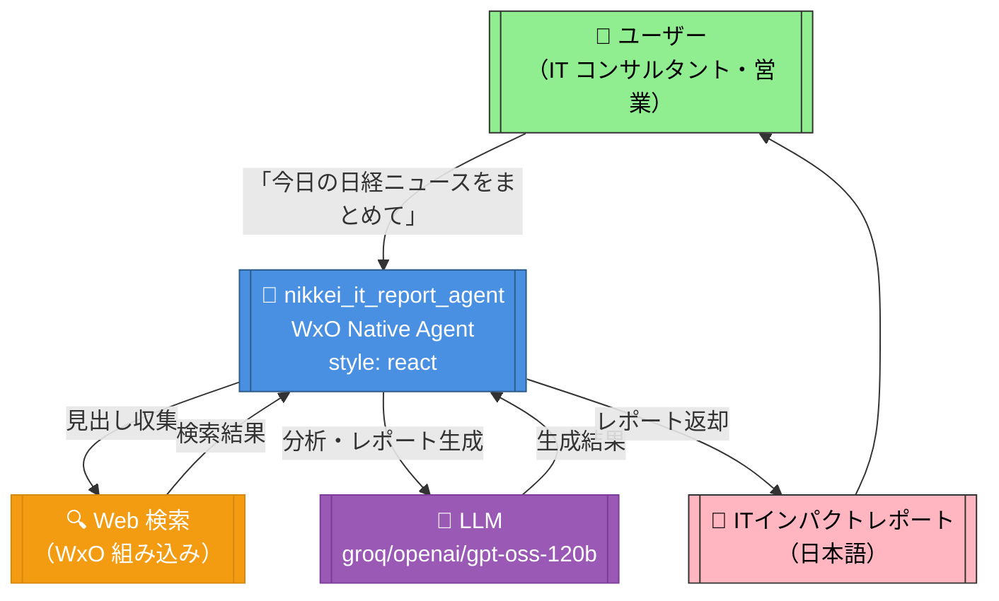
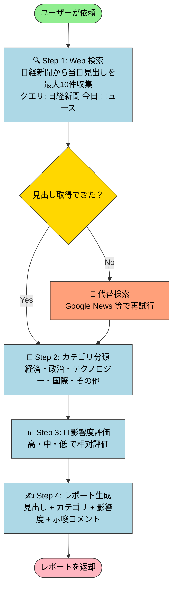

# 日経新聞 ITインパクトレポート エージェント

## 概要

日経新聞の当日朝刊主要見出しを自動収集・分析し、IT業界への影響度と示唆コメントを含む
日本語レポートを即座に提供する WxO ネイティブエージェント。

**生成日**: 2026年3月31日
**対象SOP**: [experiments/nikkei-it-impact-report-sop.md](../nikkei-it-impact-report-sop.md)
**設計規模**: XS（カスタムツールなし、WxO 組み込み機能のみ）

---

## アーキテクチャ図



---

## ワークフロー図



---

## プロジェクト構成

```
nikkei-it-report/
├── __init__.py
├── README.md                          # このファイル
├── import-all.sh                      # インポートスクリプト
├── agents/
│   └── nikkei_it_report_agent.yaml   # エージェント定義
└── generated/                         # （将来のフロースペック用）
```

---

## 使用方法

### 前提条件

```bash
# 1. venv をアクティベート
source /home/matsuo/Downloads/wxo-skills-lab/.venv/bin/activate

# 2. WxO 環境に認証
orchestrate env activate IG
```

### インポート

```bash
cd /home/matsuo/Downloads/wxo-skills-lab/experiments/nikkei-it-report
./import-all.sh
```

### チャットで試す

```bash
orchestrate chat start
# エージェント「nikkei_it_report_agent」を選択
# 「今日の日経ニュースをまとめて」と入力
```

### WxO Web 検索の有効化について

本エージェントは WxO の組み込み Web 検索機能を使用します。
インポート後、WxO UI からエージェント設定を開き、
**Web 検索ツールが有効になっていることを確認**してください。

> WxO の react スタイルエージェントは、利用可能なツールを自律的に選択して
> 多段階の推論を行います。Web 検索ツールが有効な状態で使用してください。

---

## エージェント仕様

| 項目 | 値 |
|---|---|
| エージェント名 | `nikkei_it_report_agent` |
| スタイル | `react`（多段階推論・自律ツール選択） |
| LLM | `groq/openai/gpt-oss-120b` |
| カスタムツール | なし（WxO 組み込み機能のみ） |
| 対象データ | 当日の日経新聞ウェブ掲載記事（最大10件） |
| 出力言語 | 日本語 |

---

## 出力サンプル

```
## 📰 日経新聞 ITインパクトレポート（2026年3月31日）

本日の収集件数: 8件

---

### 【政府、AI規制法案を国会提出へ】
- **カテゴリ**: 政治
- **IT影響度**: 高
- **示唆**: AI開発・利用に対する法的規制が強化される可能性があり、
  AI関連事業を展開するIT企業は対応コストの増加が見込まれる。
  コンプライアンス体制の早期整備が急務となる。

---

### 【自動車大手、EV向け半導体調達を国内回帰】
- **カテゴリ**: 経済
- **IT影響度**: 高
- **示唆**: 国内半導体需要の拡大により、半導体商社・組み込みシステムベンダーに
  新たなビジネス機会が生まれる。サプライチェーン再編への対応が求められる。

---

### 📊 本日のまとめ
本日はAI規制と半導体サプライチェーンに関する動向が注目された。
規制対応と国内調達シフトという2つのテーマが、IT業界の中期戦略に
大きな影響を与える可能性がある。特にAI事業者はコンプライアンス対応を
急ぐ必要がある。
```

---

## 関連ファイル

- [SOP ドキュメント](../nikkei-it-impact-report-sop.md)
- [Phase 2 環境構築記録](../2026-03-31_phase2_env_setup.md)
